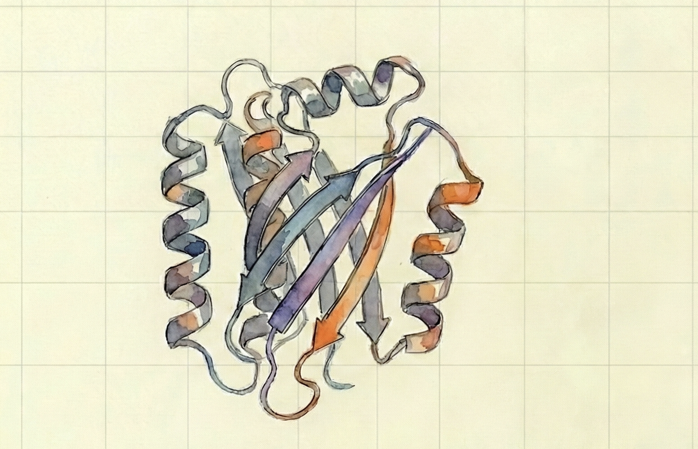

# Protein Design Environment


<div align="center">
  
</div>


A reinforcement learning environment for designing protein sequences with target motifs and charge neutrality constraints.

## Overview

The agent sequentially builds protein sequences by choosing amino acids. The goal is to create sequences that:
- **Contain target motifs**: Include specific amino acid patterns (e.g., `ARGININE, ISOLEUCINE`)
- **Maintain charge neutrality**: Achieve zero net charge to avoid penalties

## Environment Features

### Configuration Options
- **Motifs**: Fixed target motif or random motif (length 2-4) per episode
- **Sequence Length**: Fixed at 15 or variable (15-25) per episode
- **Rewards**:
  - Bonus for target motif occurrence
  - Partial bonus for individual motif amino acids in sequence
  - Penalty for non-neutral charge at episode end

### Mechanics
- **Actions**: Choose an amino acid to append to the sequence
- **Observations**: Current sequence (padded), sequence length, target motif (padded), target length, charge
- **Termination**: Episode ends when sequence reaches target length

## Installation

```bash
# Clone repository
git clone https://github.com/lorenzomagnino/Protein-Design-RL.git
cd Protein-Design-RL

# Install uv (if not already installed)
curl -LsSf https://astral.sh/uv/install.sh | sh

# Setup Python environment
uv python install 3.10.15
uv venv --python=3.10.15
source .venv/bin/activate

# Install dependencies
uv sync
pip install -e .
```

## Usage

### Quick Start
```bash
# Run rollout script
uv run python scripts/rollout.py
```

### Training
```bash
# Train with PPO (default configuration)
uv run python main.py

# Train with custom parameters
uv run python main.py algo=PPO mode=1 timesteps=100000

# Problem 2: Variable sequence length
uv run python main.py variable_length=true

# Problem 3: Variable motif and length
uv run python main.py variable_motif=true variable_length=true
```

### Testing
```bash
# Test trained model
uv run python main.py mode=2 algo=PPO take_best_model=true
```

### Visualization
```bash
# View training metrics with TensorBoard
tensorboard --logdir ./saved-model --port 6008
```
